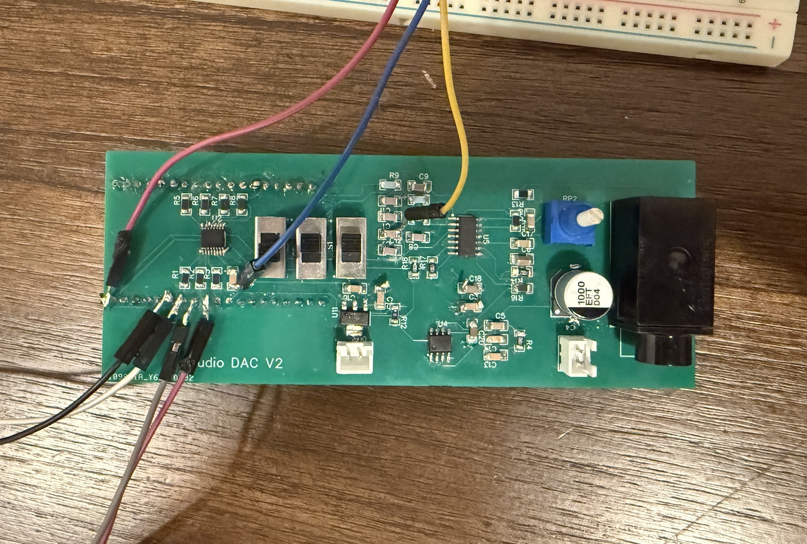

## Wireless Audio Receiver

<figure style="text-align:center">
  
  <figcaption>System Diagram</figcaption>
</figure>
  

This repo is one half of a wireless audio streaming system between two ESP32s. The code here specifically implements the receiving side of the wireless system. This includes forwarding audio data to the amplifier.

The receiver software consists of two threads (or tasks, in FreeRTOS lingo): the receive task and the playback task. 

The receive task, as its name implies, receives audio data from a transmitting ESP32 over UDP, using Wifi as the underlying [Layer 2 protocol](https://en.wikipedia.org/wiki/Internet_protocol_suite). The playback task is resonsible for taking that audio data and sending it to an external digital-to-analog converter (DAC). The DAC is a [PCM1753](https://www.ti.com/product/PCM1753), which receives audio data using the [I2S](https://docs.espressif.com/projects/esp-idf/en/stable/esp32/api-reference/peripherals/i2s.html) protocol. As mentioned before, the two tasks run in parallel, on separate cores. By splitting the receive and the playback tasks into two separate threads that run simultaneously, we ensure that the receiver doesn't miss any Wifi packets, and that audio data is always streaming to the DAC.

### Task Synchronization

The two tasks exchange data with one another using [double-buffering](https://wiki.osdev.org/Double_Buffering). The idea is that the receive task receives and loads audio data into a "back buffer" while the playback task simultaneously streams data out of a "front buffer". By having the two tasks operate on different buffers, they never have to contend for the same data.

When the playback task exhausts all of the data in the "front buffer", it signals to the receive task that it needs new data. The receive task, which periodically polls for this signal, transfers data from the back buffer to the active buffer, then signals to the playback task that new data is available.  

### Quality vs Latency

The most important goal is to ensure that the audio fed to the amplifier is clean (ie. no distortion or discontinuities). The secondary goal is minimizing latency between the guitar and the amplfier. 

To satisfy the first goal, we must ensure that the receive task always has data to forward to the playback task. If it does not have data, the playback task would either have to stall or play stale data, resulting in a distorted audio signal. The receive task avoids this waiting for several buffer's worth of data to arrive over Wifi before it starts forwarding to the playback task. Of course, if the receive task caches data for some time rather than immediately sending it to the playback task, we'll incur some latency in the audio system.  

I've played around with the caching and made it as small as possible while maintaining distortionless audio.

## Theoretical Latency
To compute the theoretical latency of this wireless system, we need to consider:

  1) The amount of time a sample is cached in the transmitting ESP32 before it is sent to the Wifi driver. Samples are cached while the [sampling task](https://github.com/rahulahooper/wireless-audio-transmitter/tree/main?tab=readme-ov-file#wireless-audio-transmitter) assembles an audio packet.
    - A sample is cached for _size_of_audio_packet_ / _sampling_rate_ = 300 / 48000 = 6.25ms
  2)  The time it takes for the ESP32s to communicate the data
    - By having the receiving ESP32 periodically echo packets back to the transmitter, we can compute the round-trip time of the wireless communication. 
    - This has been computed to be roughly 3ms --> 1.5ms for one-way communication
  3) The amount of time a sample is cached in the receiving ESP32 before it is sent to the DAC
    - The receive task caches roughly one additional buffer of data. This means that when a sample arrives at the receiving ESP32, it must wait for another packet to arrive (another 6.25ms later). 

**The theoretical total latency of the audio system, then, is roughly 14ms.** I personally don't notice the latency, but if other people do, it should be possible to further reduce the latency by reducing the audio packet size. 

### Circuit

<figure style="text-align:center; margin-bottom: 20px;">
  
    <figcaption>
    The Circuit Board (with lots of debug wires soldered on)
  </figcaption>
</figure>
   

The schematic and layout of the audio receiver are included in the repo. The circuit is responsible for receiving audio data from the ESP32 (specifially, from the playback task), filtering + amplifying the data, and sending it to some kind of speaker. The circuit can drive either a low-impedance speaker (I tested with an off-the-shelf 8-ohm speaker), or it can send data to an actual guitar amplifier.

The circuit has a bunch of switches on it so that we can test things like the ESP32's internal DAC or to bypass the anti-aliasing filter. If configured for "proper" usage, the signal flow through the circuit looks like this:

1. ESP32 streams digital audio data to PCM1753 via I2S
2. PCM1753 converts audio to analog and feeds it to a series of op amp filters
3. The op amp ([OP4134](https://www.ti.com/product/OPA4134) or its cheaper alternative, the [OPA1679](https://www.ti.com/product/OPA1679/part-details/OPA1679IDR)), attenuates and low-pass filters the audio signal.
4. If the audio data is AC-coupled and delivered to the guitar amplifier.
  - If audio data is going to a speaker instead, then it is sent to an LM386 power amplifier and AC-coupled before being sent to the speaker.

### ESP32 DAC Notes

(For reference only, only important to readers who are working with the internal ESP32 DAC).

The ESP32 has an internal digital to analog converter that converts data using DMA. The user specifies the size of the DMA buffer when they first configure the DAC. To write to the DAC, the user calls the function `dac_continuous_write_asynchronously()`, providing both a pointer to the DMA buffer as well as a separate buffer containing new data. The function then copies the new data into the DMA buffer. It is important to note that the _entire_ DMA buffer is processed by the I2S controller. This means that if the new data provided does not fill up the DMA buffer, then the DMA buffer will contain both new data and stale data.  
